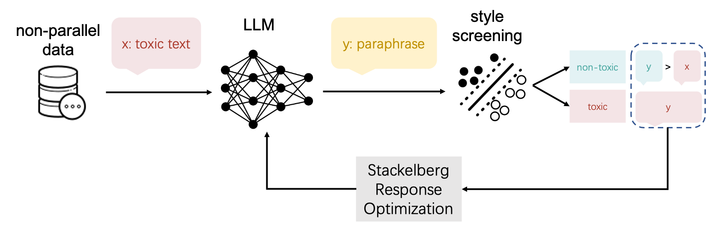

# Detoxification_LLM

Source code for [Learning from Response not Preference: A Stackelberg Approach for LLM Detoxification using Non-parallel Data](#installation)

Detoxification is an automatic transformation of a text such that:

-text becomes non-toxic.
-the content of the text stays the same.

In this project, we propose SRO model - a paraphased-based model trained on non-parallel data and can generate new text.

## SRO

### Structure

The following image is the main idea of our solution: 

To address the
challenge of incomplete preference, we propose Stackelberg response optimization (SRO), adapted from DPO, to enable the LLM to learn from the follower’s response. The gist is that SRO decreases the likelihood of generating the paraphrase if it fails the follower’s screening while performing DPO on the pair of the toxic
input and its paraphrase when the latter passes the screening. Experiments indicate that the
SRO-fine-tunned LLM achieves satisfying performance comparable to state-of-the-art models regarding style accuracy, content similarity, and fluency. 

## Training

The notebook for reproducing the training and inference of this model in the folder [SRO](t5_dpo.ipynb)

## Testing 

There are three test matrix, the toxicity can be evaluated by [toxic score](toxic_score.ipynb)

The similarity score and fluency score is got by using [style transfer evaluation](https://github.com/martiansideofthemoon/style-transfer-paraphrase) 

